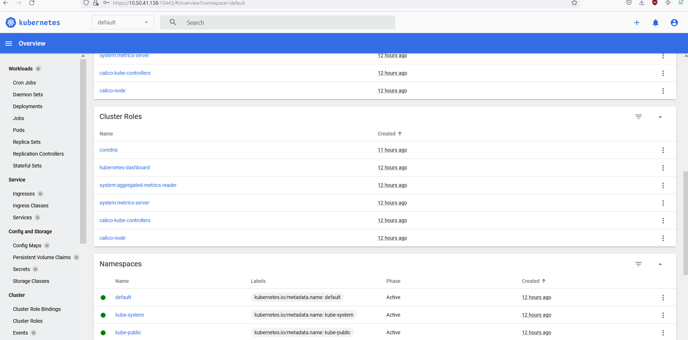

## Задание 1. Установка MicroK8S

1. Установить MicroK8S на локальную машину или на удаленную виртуальную машину
2. Установить dashboard
3. Сгенерировать сертификат для подключения к внешнему ip-адресу

```
usrcon@gitlab-podman:~$ microk8s status --wait-ready
microk8s is running
high-availability: no
  datastore master nodes: 127.0.0.1:19001
  datastore standby nodes: none
addons:
  enabled:
    dashboard            # (core) The Kubernetes dashboard
    dns                  # (core) CoreDNS
    ha-cluster           # (core) Configure high availability on the current node
    helm                 # (core) Helm - the package manager for Kubernetes
    helm3                # (core) Helm 3 - the package manager for Kubernetes
    metrics-server       # (core) K8s Metrics Server for API access to service metrics
  disabled:
    cert-manager         # (core) Cloud native certificate management
    community            # (core) The community addons repository
    gpu                  # (core) Automatic enablement of Nvidia CUDA
    host-access          # (core) Allow Pods connecting to Host services smoothly
    hostpath-storage     # (core) Storage class; allocates storage from host directory
    ingress              # (core) Ingress controller for external access
    kube-ovn             # (core) An advanced network fabric for Kubernetes
    mayastor             # (core) OpenEBS MayaStor
    metallb              # (core) Loadbalancer for your Kubernetes cluster
    minio                # (core) MinIO object storage
    observability        # (core) A lightweight observability stack for logs, traces and metrics
    prometheus           # (core) Prometheus operator for monitoring and logging
    rbac                 # (core) Role-Based Access Control for authorisation
    registry             # (core) Private image registry exposed on localhost:32000
    storage              # (core) Alias to hostpath-storage add-on, deprecated

usrcon@gitlab-podman:~$ microk8s kubectl get nodes
NAME            STATUS   ROLES    AGE   VERSION
gitlab-podman   Ready    <none>   12h   v1.26.0

usrcon@gitlab-podman:/var/snap/microk8s/current/certs$ microk8s kubectl port-forward --address 0.0.0.0 -n kube-system service/kubernetes-dashboard 10443:443
Forwarding from 0.0.0.0:10443 -> 8443
Handling connection for 10443

```


------

## Задание 2. Установка и настройка локального kubectl
1. Установить на локальную машину kubectl
2. Настроить локально подключение к кластеру
3. Подключиться к дашборду с помощью port-forward
