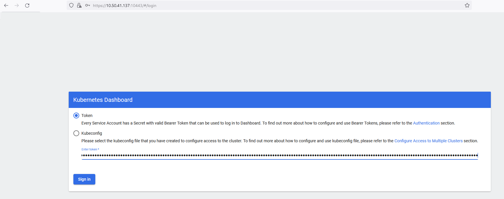
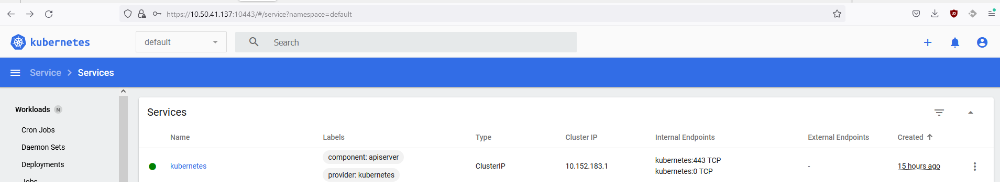

## Задание 1. Установка MicroK8S

1. Установить MicroK8S на локальную машину или на удаленную виртуальную машину
2. Установить dashboard
3. Сгенерировать сертификат для подключения к внешнему ip-адресу

```
usrcon@gitlab-podman:~$ microk8s status --wait-ready
microk8s is running
high-availability: no
  datastore master nodes: 127.0.0.1:19001
  datastore standby nodes: none
addons:
  enabled:
    dashboard            # (core) The Kubernetes dashboard
    dns                  # (core) CoreDNS
    ha-cluster           # (core) Configure high availability on the current node
    helm                 # (core) Helm - the package manager for Kubernetes
    helm3                # (core) Helm 3 - the package manager for Kubernetes
    metrics-server       # (core) K8s Metrics Server for API access to service metrics
  disabled:
    cert-manager         # (core) Cloud native certificate management
    community            # (core) The community addons repository
    gpu                  # (core) Automatic enablement of Nvidia CUDA
    host-access          # (core) Allow Pods connecting to Host services smoothly
    hostpath-storage     # (core) Storage class; allocates storage from host directory
    ingress              # (core) Ingress controller for external access
    kube-ovn             # (core) An advanced network fabric for Kubernetes
    mayastor             # (core) OpenEBS MayaStor
    metallb              # (core) Loadbalancer for your Kubernetes cluster
    minio                # (core) MinIO object storage
    observability        # (core) A lightweight observability stack for logs, traces and metrics
    prometheus           # (core) Prometheus operator for monitoring and logging
    rbac                 # (core) Role-Based Access Control for authorisation
    registry             # (core) Private image registry exposed on localhost:32000
    storage              # (core) Alias to hostpath-storage add-on, deprecated

usrcon@gitlab-podman:~$ microk8s kubectl get nodes
NAME            STATUS   ROLES    AGE   VERSION
gitlab-podman   Ready    <none>   12h   v1.26.0

usrcon@gitlab-podman:/var/snap/microk8s/current/certs$ microk8s kubectl port-forward --address 0.0.0.0 -n kube-system service/kubernetes-dashboard 10443:443
Forwarding from 0.0.0.0:10443 -> 8443
Handling connection for 10443
```


------

## Задание 2. Установка и настройка локального kubectl
1. Установить на локальную машину kubectl
2. Настроить локально подключение к кластеру
3. Подключиться к дашборду с помощью port-forward

```
usrcon@gitlab-podman2:/etc$ ip a
1: lo: <LOOPBACK,UP,LOWER_UP> mtu 65536 qdisc noqueue state UNKNOWN group default qlen 1000
    link/loopback 00:00:00:00:00:00 brd 00:00:00:00:00:00
    inet 127.0.0.1/8 scope host lo
       valid_lft forever preferred_lft forever
    inet6 ::1/128 scope host
       valid_lft forever preferred_lft forever
2: ens18: <BROADCAST,MULTICAST,UP,LOWER_UP> mtu 1500 qdisc pfifo_fast state UP group default qlen 1000
    link/ether 3e:d5:27:46:57:9a brd ff:ff:ff:ff:ff:ff
    altname enp0s18
    inet 10.50.41.137/24 brd 10.50.41.255 scope global ens18
       valid_lft forever preferred_lft forever
    inet6 fe80::3cd5:27ff:fe46:579a/64 scope link
       valid_lft forever preferred_lft forever
3: docker0: <NO-CARRIER,BROADCAST,MULTICAST,UP> mtu 1500 qdisc noqueue state DOWN group default
    link/ether 02:42:a0:fd:16:e9 brd ff:ff:ff:ff:ff:ff
    inet 172.17.0.1/16 brd 172.17.255.255 scope global docker0
       valid_lft forever preferred_lft forever
usrcon@gitlab-podman2:/etc$ cat ~/.kube/config
apiVersion: v1
clusters:
- cluster:
    certificate-authority-data: LS0tLS1CRUdJTiBDRVJUSUZJQ0FURS0tLS0tCk1JSUREekN******==
    server: https://10.50.41.138:16443
  name: microk8s-cluster
contexts:
- context:
    cluster: microk8s-cluster
    user: admin
  name: microk8s
current-context: microk8s
kind: Config
preferences: {}
users:
- name: admin
  user:
    token: L3ZVYVhBaE1oMGQ1*****

usrcon@gitlab-podman2:/etc$ kubectl get nodes
NAME            STATUS   ROLES    AGE   VERSION
gitlab-podman   Ready    <none>   15h   v1.26.0

usrcon@gitlab-podman2:/etc$ kubectl port-forward --address 0.0.0.0 -n kube-system service/kubernetes-dashboard 10443:443
Forwarding from 0.0.0.0:10443 -> 8443
Handling connection for 10443

usrcon@gitlab-podman2:~$ kubectl -n kube-system describe secret $token
Name:         kubernetes-dashboard-certs
Namespace:    kube-system
Labels:       k8s-app=kubernetes-dashboard
Annotations:  <none>

Type:  Opaque

Data
====


Name:         microk8s-dashboard-token
Namespace:    kube-system
Labels:       <none>
Annotations:  kubernetes.io/service-account.name: default
              kubernetes.io/service-account.uid: a2753c14-2daf-4c3f-873c-6ff7020533b6

Type:  kubernetes.io/service-account-token

Data
====
ca.crt:     1123 bytes
namespace:  11 bytes
token:      eyJhbGciOiJSUzI***************************


Name:         kubernetes-dashboard-csrf
Namespace:    kube-system
Labels:       k8s-app=kubernetes-dashboard
Annotations:  <none>

Type:  Opaque

Data
====
csrf:  256 bytes


Name:         kubernetes-dashboard-key-holder
Namespace:    kube-system
Labels:       <none>
Annotations:  <none>

Type:  Opaque

Data
====
priv:  1675 bytes
pub:   459 bytes

```


